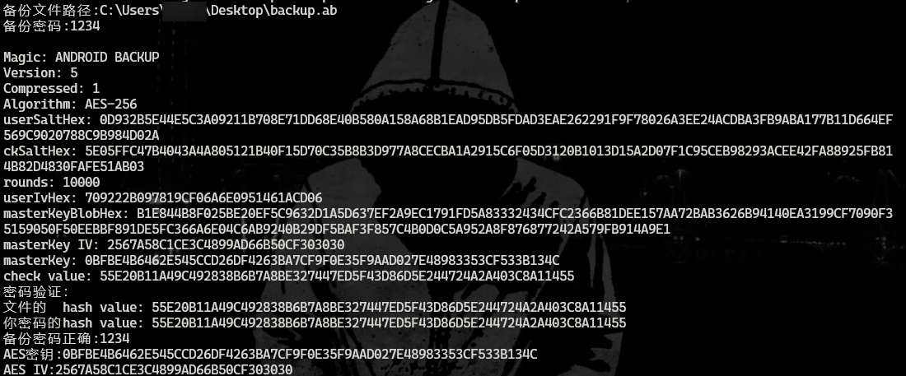
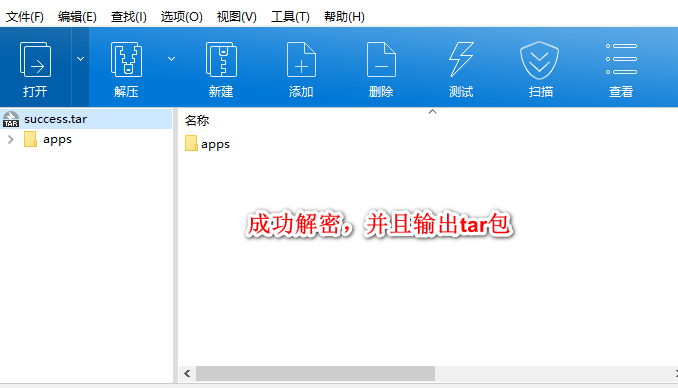

# win-abe
基于https://github.com/nelenkov/android-backup-extractor 项目，用C++写的Windows版本Android backup(安卓加密备份)解密工具。

## 依赖项

- vcpkg install openssl
- vcpkg install zlib

## Demo

```c++
#include "AndroidBackup.h"

void usage()
{
    printf("abe.exe -b backup.ab success.tar -p password\n\n");
}

int main(int argc, char* argv[])
{
    if (argc < 2)
    {
        printf("参数有误!\n");
        usage();
        return -1;
    }
    char* inputPath  = argv[2];
    char* outputPath = argv[3];
    char* password = argv[5];
    if (password == "")
    {
        printf("不支持空密码!\n");
        return -1;
    }
    printf("备份文件路径:%s\n备份密码:%s\n\n", inputPath, password);
    AndroidBackup ab = AndroidBackup();
    if (ab.extractAsTar(inputPath, outputPath, password))
    {
        cout << "写出完毕!" << endl;
    }
    else
        cout << "解密失败!" << endl;
    
    return 0;
}

```

## 使用说明

```bash
abe.exe -b backup.ab success.tar -p password
```

 

 


## 欢迎提交pr 或者bug反馈

